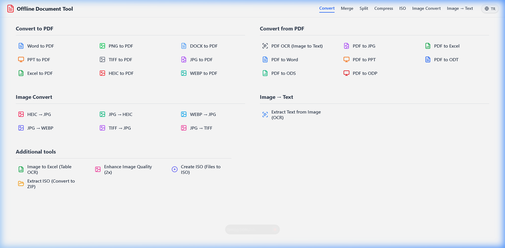
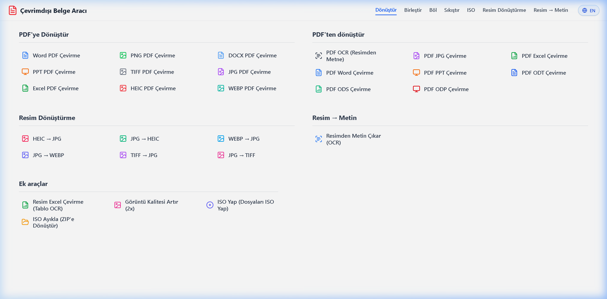

# Offline Document Tool

A robust, fully offline document processing and OCR application built with **Python (FastAPI)**, **React**, and **Tesseract-OCR**. 
Designed to run locally as a desktop application without requiring any internet connection.

## 🚀 Features

- **Multilingual Support (i18n)**: UI supports both English and Turkish out-of-the-box, with a seamless real-time language switcher.
- **Advanced PDF Operations**: Merge, split, compress, and organize PDF documents.
- **Image to PDF**: Convert various image formats to PDF.
- **Table OCR Engine**: Extracts complex table structures from images/PDFs and exports directly to styled Excel files (`.xlsx`). 
- **Image Text Extraction (OCR)**: Extracts text from images instantly into an editable format.
- **Offline First**: All processing, including heavy OCR and document manipulation, happens 100% locally on your machine for maximum privacy.
- **Modern UI**: Clean and intuitive web-based interface built with React and Tailwind CSS, served natively in a desktop window via PyWebView.
- **Standalone Export**: Bundles into a standalone folder (Windows) with all dependencies included.

## 📸 Screenshots

### English Interface


### Turkish Interface


## 🛠️ Tech Stack

- **Backend**: Python, FastAPI, PyWebView, OpenCV, PyTesseract, PyMuPDF, OpenPyXL
- **Frontend**: React, Vite, Tailwind CSS
- **Bundler**: PyInstaller

## ⚙️ Local Development (For Developers)

When cloning this repository, note that massive binary folders (`app_cache` and `_internal`) are intentionally ignored by `.gitignore` to keep the repository light. You must set them up locally.

### 1. External Binaries (Required for Development)
- **Tesseract-OCR**: Download and install it to your system (Default path: `C:\Program Files\Tesseract-OCR`).
- **Ghostscript**: Download Ghostscript (e.g., v10.02.1) and extract its `bin` and `lib` folders into a new directory named `_internal/gs/` in the project root.

### 2. Setup Python Virtual Environment (`venv`)
The `venv` folder isolates all your Python packages. You don't need to manually copy any `.exe` files into it. `pip` handles everything automatically!
```bash
# Create and activate virtual environment
python -m venv venv
venv\Scripts\activate  # On Windows

# Install all dependencies (FastAPI, PaddleOCR, PyTorch, etc.)
pip install -r requirements.txt
```

### 3. Setup Frontend
```bash
cd frontend
npm install
npm run build  # Builds the React app into frontend/dist
cd ..
```

### 4. Run Application & Auto-Download Models
```bash
python main.py
```
**Magic First Run:** When you run the application and try to process a table for the first time, PaddleOCR and HuggingFace will detect that their neural network models are missing. They will automatically connect to the internet, download the necessary models, and create the `app_cache` folder on your computer!

*Note: The script will automatically find an open port, launch the FastAPI server, and open a native desktop window.*

## 📦 Building Standalone Application (Windows .exe)
To package the app into a single standalone folder with all dependencies (including OCR models and Ghostscript) without forcing users to install anything:

1. **Install Python Dependencies (including PaddleOCR)**
   Before anything else, you must install the core Python modules (PaddleOCR, PyTorch, FastAPI, etc.):
   ```bash
   pip install -r requirements.txt
   ```

2. **Prepare the Cache Directory (`app_cache`)**
   Run the application normally in development mode once (`python main.py`) and use the OCR features. This forces the application to download all required Hugging Face (Table Transformer) and PaddleOCR models into the `app_cache/` folder automatically.

3. **Prepare the Internal Binaries (`_internal/gs`)**
   The application requires Ghostscript for certain PDF manipulations.
   - Download Ghostscript (e.g., v10.02.1)
   - Copy its `bin` and `lib` folders into `_internal/gs/` in the project root.
   *(Resulting structure: `_internal/gs/bin/` and `_internal/gs/lib/`)*

4. **Install Tesseract-OCR**
   Ensure Tesseract is installed at `C:/Program Files/Tesseract-OCR`. The PyInstaller spec file will automatically bundle this entire folder into your final build.

5. **Build with PyInstaller**
   If you don't have a `.spec` file yet, or want to use the existing `OfflineDocTool.spec`, you can compile the application by running:
   ```bash
   pyinstaller --clean OfflineDocTool.spec
   ```
   *Note: Our `OfflineDocTool.spec` is already configured to automatically include the `frontend/dist`, `app_cache`, `_internal/gs`, and `Tesseract-OCR` folders in the final build. Do not add `_internal` or `app_cache` to GitHub as they are massive binary folders.*

   The final output will be generated in the `dist/OfflineDocTool` directory. You can zip this folder and share it!

## 📄 License
This project is open-source and available under the [MIT License](LICENSE).
